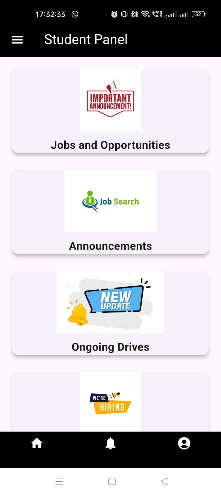
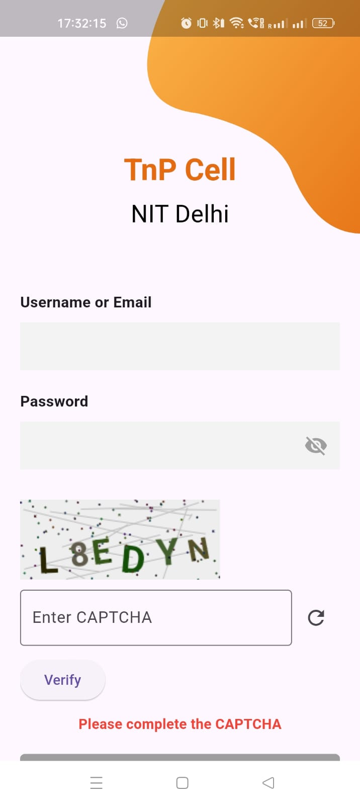
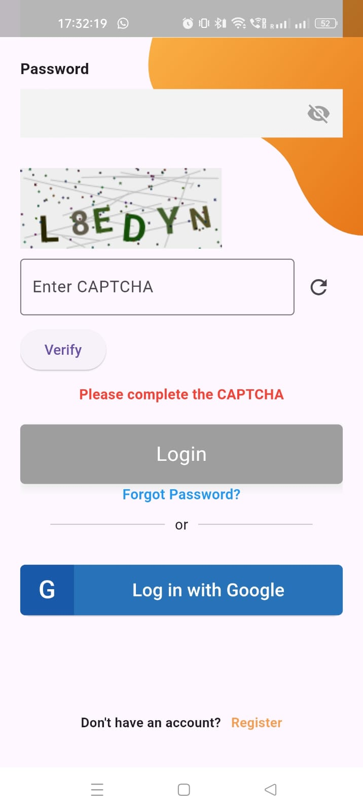
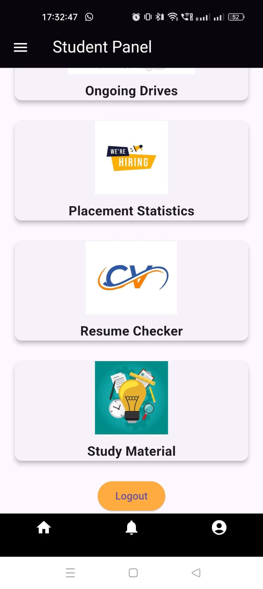
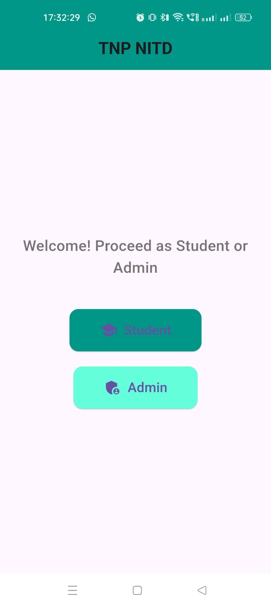

# Placement-Cell-App

## 📌 Introduction

**TNP NITD** is an application designed to streamline the job placement process for students at the National Institute of Technology Delhi. The app caters to the needs of both students and administrators by providing separate modules with tailored functionalities. The goal is to simplify processes like job applications, announcements, and feedback, while ensuring efficient communication between stakeholders.

---

## 🚀 Features

### 👨‍🎓 Student Module
- 📢 **Announcements:** Real-time placement-related updates.
- 🔍 **Job Search:** Search and apply for job opportunities.
- 📄 **CV Editing:** Create and edit CVs within the app.
- 📚 **Study Materials:** Access guides and practice resources.

### 🛠 Administrator Module
- 📢 **Manage Announcements:** Post/update placement-related news.
- 📋 **Vacancy Management:** Add or modify job vacancies.
- 🗣 **Feedback Collection:** Gather feedback from students.
- 📤 **Study Material Upload:** Upload resources for students.

---

## 💻 Technical Details

### 📱 Platform
- Developed using **Android Studio**.
- Supports both **Android** and **iOS** platforms.
- Uses **Firebase Authentication** for user sign-up/login.

### 📁 Folder Structure
- Project Root: `C:\Users\HP\AndroidStudioProjects\tnpnitd`
- Organized into folders for UI, services, and utilities.

### 🔗 Firebase Integration
- **Authentication** for secure login/signup.
- **Realtime Database** to dynamically display content.

---

## 🖼️ App Screenshots

### 🚀 Flash Screen

### 🏠 Home Page

### 🔐 Login Page

### 🔑 Login with Google

### 📤 Logout

### 🧭 Main Page

### 👤 Profile Page

---

## 📚 Getting Started

If you're new to Flutter development, check out:

- [Lab: Write your first Flutter app](https://docs.flutter.dev/get-started/codelab)
- [Cookbook: Useful Flutter samples](https://docs.flutter.dev/cookbook)
- [Flutter Documentation](https://docs.flutter.dev/)

---

> Made with ❤️ by an amazing team — **Anushka, Sonali, Mayank, and Kajal**
